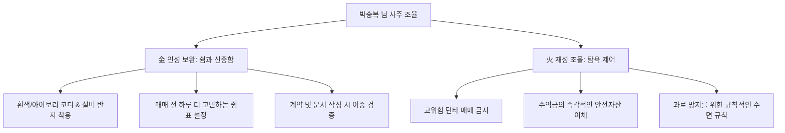

# 🔮 사주명리 종합 분석 리포트 — 박승복 님

본 분석은 **'만세력 천을귀인'**의 정밀한 로직으로 산출된 명리 데이터를 바탕으로 작성된 공식 리포트입니다. 박승복 님의 타고난 기질과 사회적 환경, 대운의 흐름, 그리고 2026년 세운 및 7월 월운의 변화까지 심층적으로 분석하였습니다.

---

## 1. 사주 원국 및 오행 분석

### 📋 사주 원국 (四柱八字)
| 구분 | 년주 (年柱) | 월주 (月柱) | 일주 (日柱) — 나 | 시주 (時柱) |
| :--- | :--- | :--- | :--- | :--- |
| **천간 (天干)** | **甲** (갑목 / 상관) | **丙** (병화 / 정재) | **癸** (계수 / 일간) | **丙** (병화 / 정재) |
| **지지 (地支)** | **子** (자수 / 비견) | **寅** (인목 / 상관) | **巳** (사화 / 정재) | **辰** (진토 / 정관) |
| **십이운성** | 建祿 (건록) | 沐浴 (목욕) | 胎 (태) | 養 (양) |

### 📊 오행 분포 (五行)
*   **木 (식상)**: 2개 (甲, 寅)
*   **火 (재성)**: 3개 (丙, 丙, 巳) — ⚠️ **다소 과다**
*   **土 (관성)**: 1개 (辰)
*   **金 (인성)**: 0개 (❌ 부재)
*   **水 (비겁)**: 2개 (癸, 子)

> **핵심 구조**: 상관생재(傷官生財) 격국 | 원국 金 부재 | 재성(火) 과다형 구조

---

## 2. 기질 및 중심 성격 분석

### ① 일간과 일주 중심의 기질
*   **본질적인 자아 — 계수(癸水) 일간**  
    계수는 졸졸 흐르는 맑은 시냇물이자 하늘에서 대지를 적시는 단비입니다. 영리하고 유연하며 예의가 바르고, 주변 상황에 맞춰 조화롭게 녹아드는 뛰어난 처세술과 지혜를 지녔습니다. 겉으로는 조용하고 부드러워 보이지만 끈기가 대단히 훌륭합니다.
*   **복록과 귀인의 조화 — 계사(癸巳) 일주**  
    태어난 날의 기둥이 귀인 성향을 지닌 계사 일주입니다. 60갑자 중 대표적인 귀인 일주이자 재관(財官)이 함께 모인 **'록마동향(祿馬同鄕)'**입니다. 지장간 속 무토(정관)·경금(정인)·병화(정재)의 유기적인 상생으로 평생 의식주 복록이 풍족하며, 위기의 순간마다 나를 건져주는 **천을귀인(天乙貴人)**의 축복을 타고나 비즈니스적 직관과 현실 감각이 매우 뛰어납니다.

### ② 사회적 환경과 역량 발휘
*   **상관생재(傷官生財)의 활동 무대**  
    월지의 寅木(상관)이 월간과 시주의 丙火(정재)를 맹렬히 생하는 상관생재 사주입니다. 본인의 창의적인 아이디어, 기술, 화술(식상)을 활용하여 구체적이고 현실적인 재물과 실적(재성)으로 바꾸어 내는 뛰어난 비즈니스 환경에 놓여 있습니다. 머리로 기획하여 눈에 보이는 결과물을 만들어내는 기획력과 창작 능력이 사회적 무대에서 핵심 무기가 됩니다.
*   **원국 金(인성) 부재와 재성(火) 과다**  
    일하려는 욕구와 벌어들이려는 재물(火)은 대단히 팽창해 있으나, 이를 이성적으로 제어하고 생각을 정리하며 쉼표를 찍어주는 브레이크인 금(金·인성)이 지장간(사화 속 경금) 외에 원국에 없습니다. 이로 인해 추진력과 목표 의식은 매우 강하나, 순간적인 탐욕이나 시장 분위기에 휩쓸려 냉정함을 잃고 **뇌동매매**를 하거나 쉽게 과로에 노출될 수 있는 약점이 있습니다.

---

## 3. 대운 분석: 신미(辛未) 대운 (42세 ~ 51세)

*   **대운 간지**: 辛未 (편인 辛 / 편관 未)
*   **십이운성**: 묘 (墓)

### 부족한 金 기운의 보완과 단련
1.  **편인 辛金을 통한 브레이크 장착**:  
    원국에 전혀 없던 금(金·인성) 기운이 대운 천간에서 강력한 辛金(편인)으로 들어옵니다. 이는 날카로운 통찰력, 고도의 전문 지식 습득, 혹은 문서화된 자산의 획득을 뜻합니다. 섣부른 행동을 멈추고 냉철하게 시장을 리서치하며 자신을 제어하는 훌륭한 제동 장치가 장착되는 흐름입니다.
2.  **편관 未土를 통한 원칙 준수**:  
    대운 지지의 未土(편관)가 원국 지지들과 어우러져 엄격한 규율과 책임감을 부여합니다. 12운성 **'묘(墓)'**의 작용으로 현금을 안전하게 금고에 가두고 지출을 통제하는 기조가 형성됩니다.

> [!TIP]
> **대운 핵심 기회**  
> 이 시기에는 날뛰는 재물 욕구(火)를 가라앉히고, 전문 자격을 취득하거나 자산을 부동산·연금 등 묶인 문서 자산으로 굳혀두기에 가장 유리합니다.

---

## 4. 2026년 병오(丙午)년 세운 분석

*   **세운 간지**: 丙午 (정재 丙 / 편재 午)
*   **십이운성**: 절 (絶)

### 변동성 극대화와 심리 제어의 해
1.  **화(火) 기운의 극대화**:  
    천간 丙火와 지지 午火가 결합하여 엄청난 열기의 재성 기운이 들어옵니다. 비트코인 등 고위험 자산의 극심한 널뛰기 흐름처럼, 인생에서 재물에 대한 성과 욕구와 기회가 동시에 팽창합니다.
2.  **군비쟁재와 뇌동 리스크**:  
    년지의 子水(비견)가 세운 지지 午火와 **자오충(子午沖)**을 하여 내면적 자아와 재물이 강하게 충돌합니다. 순간적으로 일확천금의 욕망에 사로잡혀 고점 추격 매수(뇌동매매)를 하거나, 주변인의 감언이설에 속아 자산을 잃을 위험이 매우 큽니다.
3.  **실전 행동 지침 (코인 투자 전략)**:  
    *   *겁재/편관 시간대*: 심리 리스크 **'위험'** 포지션입니다. 즉시 매매를 일시 정지하고 MTS 창을 꺼야 탈재를 막습니다.
    *   *식신/정인/편인 시간대*: 심리 리스크 **'안정'** 포지션입니다. 부족한 금(金) 기운이 보완되어 냉철한 분석과 백테스팅이 가능하므로 이 시간에만 계획적으로 원칙 분할 대응을 하십시오.

---

## 5. 2026년 7월 을미(乙未)월 월운 분석

*   **월운 간지**: 乙未 (식신 乙 / 편관 未)
*   **십이운성**: 묘 (墓)

### 식신제살(食神制殺)을 통한 난제 해결
1.  **식신 乙木의 수생목(水生木) 소통**:  
    내 아이디어와 재능(식신)이 원국의 수(水)를 자연스럽게 빼내어 활용하게 됩니다. 창의적인 기획력이 빛을 보게 됩니다.
2.  **식신제살과 위기 돌파**:  
    천간의 乙木 식신이 지지의 未土 편관(스트레스, 어려운 일)을 극하여 제어하므로, 투자 시장의 급변동이나 직장에서 발생한 갑작스러운 위기 상황을 본인의 지혜롭고 기발한 해결책으로 완벽히 통제하고 공을 세우게 됩니다.
3.  **12운성 '묘(墓)'의 수렴**:  
    7월은 에너지를 안으로 거두어들이는 수렴의 달입니다. 무리하게 판을 넓히지 마시고, 7월 한 달 동안은 조용히 차트를 복기하고, 자산 현황을 점검하며 공부에 집중하는 것이 백번 유리합니다.

---

## 6. 오행 조절을 위한 실생활 개운법 (開運法)

박승복 님은 **금(金)** 기운이 전혀 없고 **불(火)** 기운이 과다하여 심리적인 제동 장치가 약해지기 쉬운 흐름을 보입니다.

*   **金 (정인·편인) 보완책 (안정적 브레이크와 학문적 내실)**:
    *   *색상*: 일상복이나 소품에 **흰색, 실버, 골드** 계열을 자주 활용하세요.
    *   *습관*: 평소에 은반지를 착용하시는 것이 기류의 균형에 도움이 됩니다. 충동적인 진입 욕구가 생길 때마다 "10분간 심호흡하고 원칙을 다시 보자"는 규칙을 정하십시오. 명상과 요가, 혹은 서재에서 책을 읽는 정적인 시간이 필수적입니다.
*   **火 (정재·편재) 조율법 (흥분 조절과 리스크 관리)**:
    *   *습관*: 하루 중 火 기운이 강한 시간대(낮 11시~3시) 혹은 세운/시운의 편재 기운이 치솟을 때는 무리한 베팅이나 충동 진입을 강하게 차단해야 합니다. 규칙적인 수면으로 뇌의 피로를 풀어주어 과다한 열기를 시켜주어야 합니다.

---

## 7. 명리학 전문가의 핵심 삶의 조언
> **"달리는 마차에 튼튼한 브레이크를 달고, 맑은 지혜의 옹달샘을 지키십시오."**

박승복 님은 뛰어난 기획력과 재물에 대한 감각을 타고났습니다. 상관생재의 기운은 날카로운 칼과 같아 대단한 성과를 일궈낼 수 있지만, 제어 장치(인성)가 부족하면 칼에 내 몸이 다치기 쉽습니다. 

투자나 비즈니스 영역에서 가장 중요한 것은 많이 버는 것이 아니라 **'원칙을 지켜 내 자산을 잃지 않는 것'**입니다. 대운에서 찾아온 귀중한 辛金(인성)의 기운을 무기로 삼아 늘 이성적이고 냉철하게 분석하고, 탐욕이 올라올 때마다 내면의 쉼표를 찍어주는 삶의 태도를 견지하십시오. 이 지혜를 행하신다면 천을귀인의 따뜻한 보호 아래 평생 풍요롭고 안전한 복록을 온전히 누리실 것입니다.
