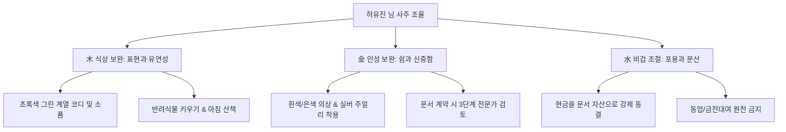

# 🔮 사주명리 종합 분석 리포트 — 허유진 님

본 분석은 **'만세력 천을귀인'**의 정밀한 로직으로 산출된 명리 데이터를 바탕으로 작성된 공식 리포트입니다. 허유진 님의 타고난 기질과 사회적 환경, 대운의 흐름, 그리고 2026년 세운 및 7월 월운의 변화까지 심층적으로 분석하였습니다.

---

## 1. 사주 원국 및 오행 분석

### 📋 사주 원국 (四柱八字)
| 구분 | 년주 (年柱) | 월주 (月柱) | 일주 (日柱) — 나 | 시주 (時柱) |
| :--- | :---: | :---: | :---: | :---: |
| **천간 (天干)** | **壬** (임수 / 겁재) | **壬** (임수 / 겁재) | **癸** (계수 / 일간) | **丙** (병화 / 정재) |
| **지지 (地支)** | **戌** (술토 / 정관) | **子** (자수 / 비견) | **巳** (사화 / 정재) | **辰** (진토 / 정관) |
| **십이운성** | 衰 (쇠) | 建祿 (건록) | 胎 (태) | 養 (양) |

### 📊 오행 분포 (五行)
*   **木 (식상)**: 0개 (❌ 부재)
*   **火 (재성)**: 2개 (丙, 巳)
*   **土 (관성)**: 2개 (戌, 辰)
*   **金 (인성)**: 0개 (❌ 부재)
*   **水 (비겁)**: 4개 (壬, 壬, 癸, 子) — ⚠️ **극강함**

> **핵심 구조**: 비겁 과다 | 군비쟁재(群比爭財) 주의 | 지장간 재관인(財官印) 상생 구조

---

## 2. 기질 및 중심 성격 분석

### ① 일간과 일주 중심의 기질
*   **본질적인 자아 — 계수(癸水) 일간**  
    계수는 맑은 옹달샘, 이슬비, 혹은 지혜를 상징합니다. 기본적으로 영리하며 사려 깊고 주변 사람들에게 부드럽게 스며드는 유연성과 적응력이 탁월합니다. 직관력이 강하며 내면에 강인한 회복탄력성과 끈기를 감추고 있습니다.
*   **복록과 귀인의 결합 — 계사(癸巳) 일주**  
    물(癸水)이 따뜻한 대지(巳火) 위에 자리 잡은 자태입니다. 60갑자 중 대표적인 귀인 일주이자 재관(財官)이 함께 모인 **'록마동향(祿馬同鄕)'**입니다. 지장간 속 무토(정관)·경금(정인)·병화(정재)가 아름답게 유통되어 기본적으로 현실적인 경제 감각이 뛰어나고, 예의를 중시하며 일생 동안 뜻밖의 인복과 귀인의 혜택(천을귀인)을 입는 훌륭한 길성을 지녔습니다.

### ② 사회적 환경과 역량 발휘
*   **비견격(比肩格)과 경쟁 환경**  
    월지 자수(子水) 비견을 기반으로 수(水) 비겁이 극도로 강한 신왕(身旺) 사주입니다. 허유진 님이 놓이기 쉬운 환경은 치열한 경쟁 구도 속이거나, 주체성과 실력을 가진 프로들이 모인 독립적인 무대입니다. 남에게 통제받기보다는 주도권을 잡고 일할 때 성과가 극대화됩니다.
*   **장단점 및 인생 흐름**  
    *   *장점*: 뚝심과 자립심이 강하여 어떤 시련 앞에서도 굴하지 않으며, 말년으로 갈수록 재관(丙辰)의 힘이 확고해져 후반부에 큰 사회적 안정과 부를 쥐는 흐름입니다.
    *   *단점*: 천간의 겁재(壬水)들이 나의 재물(丙火)을 노리는 **군비쟁재**의 위협이 있습니다. 동업이나 금전 거래 시 사기나 배신을 주의해야 하며, 지나친 자존심으로 인해 대인관계에서 경직될 수 있습니다.

---

## 3. 대운 분석: 무신(戊申) 대운 (40세 ~ 49세)

*   **대운 간지**: 戊申 (정관 戊 / 정인 申)
*   **십이운성**: 死 (사)

### 官印相生(관인상생)을 통한 명예와 문서의 획득
1.  **무계합(戊癸合)을 통한 기류 안정**:  
    대운 천간의 戊土(정관)가 나(癸水)와 합을 이루어 넘치는 수(水) 기운을 안정된 제방으로 제어해 줍니다. 치열했던 사회적 생존 경쟁에서 벗어나 공적인 권위나 안정된 직위, 명예를 성취하는 안정적 기반이 마련됩니다.
2.  **사신형합(巳申刑合)과 문서의 장악**:  
    대운 지지의 申金(정인)이 일지 巳火와 만나며 문서의 취득(부동산 매입, 권리 장악, 라이선스 획득)이 활발해지는 시기입니다. 12운성 **'사(死)'**의 작용으로 활발한 외부 활동보다는 한 분야를 깊게 파고들어 자격을 완성하는 정신적 집중력이 극대화됩니다.

> [!WARNING]
> **대운 주의사항 (사신형)**  
> 巳申형의 작용으로 뼈, 관절 계통의 건강이나 수술 수에 유의하셔야 하며, 모든 종류의 계약 및 보증 문서 작성 시 꼼꼼한 약정 확인이 절대적으로 필수적입니다.

---

## 4. 2026년 병오(丙午)년 세운 분석

*   **세운 간지**: 丙午 (정재 丙 / 편재 午)
*   **십이운성**: 절 (絶)

### 변동성 극대화의 해와 자산 수성 전략
1.  **수화상쟁(水火相爭)과 군비쟁재**:  
    천간과 지지가 모두 강력한 불(火·재성)로 들어옵니다. 내 원국의 강한 물(水)과 정면으로 부딪치며 재물에 대한 성과 욕구와 활동력이 극대화됩니다. 큰 수익을 볼 기회가 들어오지만, 동시에 겁재에 의한 **탈재(奪財) 리스크**가 어느 해보다 큽니다.
2.  **대운 정관(戊土)의 중재**:  
    다행히 대운의 정관이 겁재들을 통제하여, 공적인 신뢰 관계나 원칙을 지킨 매매를 통하면 내 몫의 재물을 끝내 지켜낼 수 있습니다.
3.  **실전 행동 지침**:  
    올해 벌어들이는 자산은 절대 재투자하거나 현금으로 보유하지 말고, **대운의 정인(申金·문서)을 활용하여 즉시 부동산이나 장기 저축 등 '묶인 자산'으로 치환**해 굳혀야 합니다. 동업이나 지인의 투자 제안에는 단호히 거절을 고수해야 수성을 이룰 수 있습니다.

---

## 5. 2026년 7월 을미(乙未)월 월운 분석

*   **월운 간지**: 乙未 (식신 乙 / 편관 未)
*   **십이운성**: 묘 (墓)

### 식신제살(食神制殺)과 수렴의 타이밍
1.  **식신 乙木의 에너지 통로 개방**:  
    원국에 없던 木(식상) 기운이 월운에서 들어와 꽁꽁 갇혀 있던 수(水) 기운을 시원하게 소통시킵니다. 본인의 지혜와 기획력을 세상에 펼치는 계기가 마련됩니다.
2.  **난제 해결과 식신제살**:  
    천간의 乙木 식신이 지지의 未土 편관(스트레스, 어려운 일)을 극하여 제어하므로, 직무나 사업 영역에서 오랫동안 골머리를 앓던 **난제나 까다로운 분쟁을 본인의 기획력과 돌파력으로 완전히 해결하는 쾌거**를 이룹니다.
3.  **12운성 '묘(墓)'의 지침 (안정과 입단속)**:  
    묘지는 수렴과 저장의 기운입니다. 7월 한 달 동안은 바깥 활동을 억지로 넓히기보다 본인의 내실을 다지고 서류를 정돈하며 조용히 실력을 응축시키는 것이 완벽히 유리합니다. 남의 구설에 참견하지 말고 말을 아끼는 자세가 좋습니다.

---

## 6. 오행 조절을 위한 실생활 개운법 (開運法)

허유진 님은 **목(木)과 금(金)** 기운이 부족하고 **물(水)** 기운이 넘쳐 기류의 흐름이 한쪽으로 치우치기 쉽습니다. 실생활에서 에너지를 조율하는 방법입니다.

*   **木 (식신·상관) 보완책 (감정 소통과 생기 수렴)**:
    *   *색상*: 일상복이나 인테리어에 **초록색, 그린, 카키** 계열을 자주 활용하세요.
    *   *습관*: 아침 산책이나 등산을 통해 숲의 나무 기운을 쐬고, 본인의 감정이나 떠오르는 아이디어를 매일 일기장이나 기획 노트에 글로 적어 표현(설기)해 주는 습관이 대단히 길합니다. 신맛이 나는 매실이나 과일을 섭취하는 것도 건강에 도움을 줍니다.
*   **金 (정인·편인) 보완책 (안정적 브레이크와 필터)**:
    *   *색상*: 깨끗한 **흰색, 아이보리, 실버** 계열의 의상을 입으면 마음의 안정을 줍니다.
    *   *습관*: 은이나 화이트골드 재질의 반지를 착용하는 것을 추천합니다. 매사에 결정을 서두르지 말고 "하루 더 생각해보자"며 쉼표를 찍어주는 연습이 필요하며, 중요한 계약 시 반드시 더블 체크하는 필터를 가져야 합니다.

---

## 7. 명리학 전문가의 핵심 삶의 조언
> **"나무는 물을 먹고 자라고, 굳건한 흙은 물길을 아름답게 다듬습니다."**

허유진 님은 지혜를 품은 계수로서, 언제든 스스로의 돛을 올리고 목적지를 향해 힘차게 항해할 수 있는 튼튼한 내공을 가졌습니다. 다만, 물길이 너무 드세면 논밭을 휩쓸어 버리듯, 과한 자존심과 고집이 때로는 소중한 사람들과의 관계를 쓸어내릴 수 있습니다.

타인의 조언을 겸손히 경청하여 흙(제방)으로 삼고, 나만의 지식과 열정을 타인을 돕는 따뜻한 표현(나무)으로 승화시키십시오. 재물은 크게 벌어들이는 것보다 안전하게 가두어 문 문서로 만드는 것이 평생의 재복을 지키는 요체입니다. 이 지혜를 마음에 새기신다면, 계사(癸巳) 천을귀인의 복록이 허유진 님의 중년과 말년을 더욱 환하고 풍요롭게 비추어 줄 것입니다.
